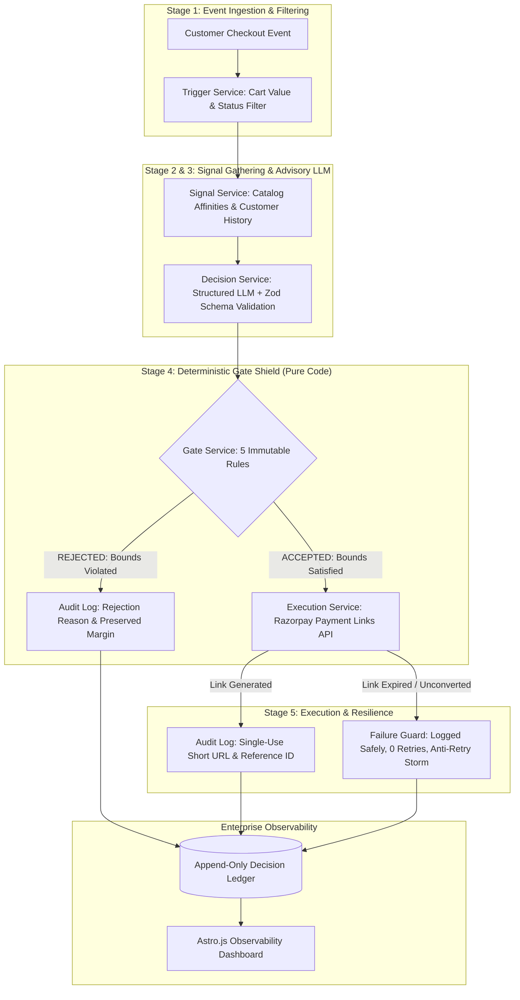

# UpsellX AI — Autonomous Upsell & Cross-Sell Engine

[](https://github.com/AJAYMYTH/RazorPulse-ai/actions/workflows/ci.yml)
[](https://nodejs.org/)
[](https://www.typescriptlang.org/)
[](https://razorpay.com/)
[]()
[](LICENSE)
[]()

> **UpsellX AI** is an enterprise-grade autonomous commerce agent designed for high-growth Razorpay merchants. It ingests post-checkout transaction events, formulates explainable co-purchase recommendations, enforces deterministic profit margin gates in code, executes real Razorpay Payment Links, and maintains an immutable audit ledger visualized on a Vercel Geist-styled dashboard.

---

## 1. System Architecture



---

## 2. Core Architectural Invariants

### A. Separation of Intelligence and Authority
Artificial intelligence models are treated as **advisory recommenders**, never final decision authorities. No LLM has direct execution permissions to any money API. All recommendations must pass a deterministic code gate before payment creation.

### B. The Deterministic Margin Shield (5 Hard Code Bounds)
1. **Max Discount Ceiling (Rule 1):** `discount_pct <= 15` &rarr; Rejects if the model suggests >15% to strictly defend merchant gross profit margins.
2. **Single Offer Idempotency (Rule 2):** Prevents duplicate promotional offers for the same checkout event (`ruleViolated: "one_offer_per_order"`).
3. **Order Status Eligibility (Rule 3):** Automatically halts offer creation if the triggering order is `refunded`, `disputed`, or `failed`.
4. **Minimum Requisite Confidence (Rule 4):** `confidence >= 0.60` &rarr; Discards speculative, low-confidence pairings.
5. **Catalog SKU Verification (Rule 5):** Rejects offers if the recommended item is not found in the verified merchant catalog.

### C. Human-Readable Explainability (Zod Validated)
Every offer is validated against a strict TypeScript Zod schema requiring:
- `action`: `'cross_sell' | 'upsell' | 'none'`
- `recommended_sku`: Valid catalog identifier
- `discount_pct`: Number between 0 and 15
- `confidence`: Confidence metric between 0.00 and 1.00
- `reason`: Plain-language explanation linking the customer's prior basket to the complementary recommendation

### D. Anti-Retry-Storm Resilience
When payment links expire without customer conversion, naive bots enter infinite retry loops, risking customer harassment and gateway rate-limiting. UpsellX AI enforces an **anti-retry-storm invariant**: exactly zero retries are attempted, the terminal state is logged, and the pipeline continues smoothly.

### E. Non-Custodial Bring-Your-Own-Key (BYOK) Security
- **Zero Intermediary Custody:** 100% of customer funds flow directly from the buyer to the merchant's Razorpay balance.
- **Zero Model Training:** Merchant transaction signals are never used to train third-party foundation models.
- **Dynamic AI Key Management:** Support for Google Gemini, OpenAI, or local intelligent heuristic matching.

---

## 3. Technology Stack

- **Backend Runtime:** Node.js 20+, Express.js, TypeScript
- **Payment Infrastructure:** Official Razorpay Node SDK (`razorpay`)
- **Intelligence Engine:** Google Generative AI SDK (`@google/generative-ai`), OpenAI API, Zod schema validation
- **Frontend Dashboard:** Astro 5, Tailwind CSS, Anime.js (micro-interactions & animated metric counters)
- **Design System:** Vercel Geist Design Specification (`#fafafa` canvas, `#171717` ink, 1px hairline borders)
- **Database & Storage:** Dual-mode Supabase PostgreSQL with Row-Level Security (RLS) + local file-backed JSON store
- **Quality Assurance:** Vitest test suite with 100% boundary test coverage

---

## 4. Quickstart Guide

### Prerequisites
- Node.js 20+ (tested on v20 and v24)
- npm 10+

### 1. Clone & Setup Environment
```bash
git clone https://github.com/AJAYMYTH/RazorPulse-ai.git
cd RazorPulse-ai
cp .env.example .env
```

### 2. Configure Credentials (`.env`)
```ini
# Server Port
PORT=3000

# Razorpay Test Gateway Keys (Direct Settlement)
RAZORPAY_KEY_ID=rzp_test_...
RAZORPAY_KEY_SECRET=...

# AI Provider Key (BYOK — Free tier available on Google AI Studio)
GEMINI_API_KEY=AIzaSy...

# Optional: Supabase PostgreSQL (Falls back to local store if omitted)
SUPABASE_URL=
SUPABASE_SERVICE_ROLE_KEY=
```

### 3. Install Dependencies
```bash
npm install
```

### 4. Run Unit Tests (Gate Layer & Auth Services)
```bash
npm test
```
*Executes 12 unit tests covering all 5 deterministic gate bounds, idempotency checks, and merchant authentication.*

### 5. Execute Batch Pipeline (15 Demonstration Orders)
```bash
npm run batch
```
*Processes 15 orders demonstrating: 14 formulated, 9 approved, 6 gate-blocked, and 1 handled runtime failure.*

### 6. Start Development Servers
```bash
npm run dev
```
- **Backend API:** `http://localhost:3000`
- **Dashboard UI:** `http://localhost:4321`

---

## 5. API Reference

| Method | Endpoint | Description |
|---|---|---|
| `GET` | `/api/health` | Service health, environment, and database connection status |
| `GET` | `/api/batch/summary` | Aggregated KPI metrics, gate outcomes, and rejection distribution |
| `GET` | `/api/orders` | Enriched order records with gate outcomes and payment links |
| `GET` | `/api/orders/:id/trail` | Chronological 5-stage audit decision trail for a specific order |
| `GET` | `/api/failures` | Isolated ledger of handled execution errors and link expiries |
| `POST` | `/api/orders/seed` | Re-seeds synthetic merchant orders and triggers the pipeline |
| `POST` | `/api/auth/login` | Merchant authentication and session token issuance |
| `POST` | `/api/auth/signup` | New merchant tenant registration |
| `GET` | `/api/settings` | Retrieve active AI provider status and gateway parameters |
| `POST` | `/api/settings` | Update BYOK AI keys and store configuration |
| `POST` | `/api/settings/test-key` | Verifies live AI API key connectivity |

---

## 6. Regulatory & Security Compliance

- **PCI-DSS Level 1:** Non-custodial architecture; all payment information is entered on official Razorpay-hosted pages (`https://rzp.io/...`).
- **PostgreSQL Row-Level Security (RLS):** Cryptographic tenant isolation enforced at the database layer using `merchant_id`.
- **Digital Personal Data Protection (DPDP) Act 2023 & GDPR:** Data minimization in signal extraction; zero PII stored in decision payloads.
- **NPCI Unified Agentic Protocol (UAP):** Strict alignment with agentic commerce guidelines requiring verifiable audit logs and code-level authorization.

---

## 7. Governance, Security & Community

- **License:** Distributed under the MIT License. See [LICENSE](LICENSE) for details.
- **Security Policy:** Comprehensive threat model, vulnerability reporting SLA, and safe harbor disclosures are available in [SECURITY.md](SECURITY.md).
- **Code of Conduct:** Community pledge and standards adapted from Contributor Covenant v2.1 in [CODE_OF_CONDUCT.md](CODE_OF_CONDUCT.md).
- **Contributing Guide:** Architecture invariants and pull request workflow detailed in [CONTRIBUTING.md](CONTRIBUTING.md).
