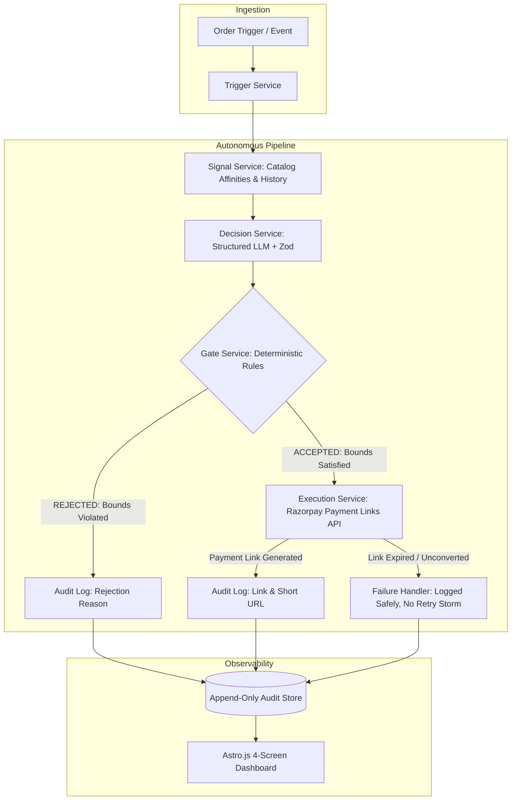

# RazorPulse AI — Autonomous Upsell & Cross-Sell Agent
**Razorpay Buildathon 2026 · Track 1: AI Growth & Agentic Commerce**

> **RazorPulse AI** is an autonomous agent that monitors merchant orders via Razorpay test-mode APIs, evaluates high-affinity upsell and cross-sell opportunities, gates every money decision with strict deterministic bounds, executes real Razorpay Payment Links, and logs an append-only audit trail visualized on a Geist-styled Astro.js dashboard.

---

## 1. System Architecture



---

## 2. Buildathon Rubric Alignment Matrix

| Rubric Criteria | Architecture Implementation | Verification Screen / Script |
|---|---|---|
| **Revenue Growth Automation** | Monitors customer order events and catalog co-purchase affinities; formulates targeted upsells & cross-sells unattended. | `npm run batch` / Home Batch Summary |
| **Every Money Action Explainable** | Structured LLM decisions validated with Zod; every decision includes explicit human-readable reasoning and confidence score. | Order Trail Timeline (`/orders/:id`) |
| **Bounded & Gated** | 100% deterministic pure function enforcing 5 hard bounds (≤15% discount cap, one offer per order, eligibility, confidence threshold, catalog SKU existence). LLM has ZERO control over bounds. | Gate Stage on `/orders/:id` & Vitest suite (`npm test`) |
| **Graceful Failure Handling** | Simulates Payment Link expiry and malformed LLM responses; logs error state without crashing or triggering runaway retry loops. | Handled Failure Log (`/failures`) & `npm run failure-demo` |
| **Real Payment Integration** | Integrates official `razorpay` npm SDK in test mode (`rzp_test_...`) with idempotent `reference_id` generation. | Payment Links visible on `/orders/:id` |

---

## 3. The 5 Deterministic Gate Rules (TRD §5)

1. **Max Discount Cap:** `discount_pct <= 15` &rarr; Rejects if model suggests >15% to protect merchant margins.
2. **One Offer Per Order:** Prevents duplicate offers if the order is re-processed (Idempotency Guard).
3. **Order Eligibility:** Rejects if order status is `refunded` or `disputed`.
4. **Minimum Confidence:** `confidence >= 0.60` &rarr; Rejects low-confidence or hallucinated affinities.
5. **Valid Catalog SKU:** Rejects if the recommended SKU does not exist in the merchant's active catalog.

---

## 4. Quickstart Guide

### Prerequisites
- Node.js 20+ (tested on v24)
- npm 10+

### Setup Environment
1. Copy `.env.example` to `.env`:
   ```bash
   cp .env.example .env
   ```
2. Add your credentials in `.env`:
   - **Razorpay Test Keys:** `RAZORPAY_KEY_ID=rzp_test_...`, `RAZORPAY_KEY_SECRET=...` *(If left blank, automatic mock payment mode activates)*
   - **LLM Provider (BYOK):** `GEMINI_API_KEY=...` *(Free tier on Google AI Studio; if omitted, intelligent heuristic fallback engine activates)*
   - **Supabase (Optional):** `SUPABASE_URL=...`, `SUPABASE_SERVICE_ROLE_KEY=...` *(If omitted, local file-backed JSON store activates)*

### Install Dependencies
```bash
npm install
```

### Run Unit Tests (Gate Layer Boundary Tests)
```bash
npm test
```

### Run Batch Pipeline Execution (15 Demonstration Orders)
```bash
npm run batch
```

### Start Development Servers (Backend + Dashboard)
```bash
npm run dev
```
- **Backend API:** `http://localhost:3000`
- **Astro Dashboard:** `http://localhost:4321`

---

## 5. Live Pitch Demo Walkthrough (4-Step Flow)

Designed specifically for the 5-minute pitch video:
1. **Step 1: `/` (Batch Summary)**
   - Highlight the top KPI row (15 orders processed, gate accepted, gate rejected, handled failures).
   - Point out the **Deterministic Gate Enforcement Breakdown** chart proving why bounds were enforced.
2. **Step 2: `/orders/:accepted_id` (Accepted Order Trail)**
   - Walk down the 5 vertical stages:
     - **Stage 1 (Trigger):** Order ingestion
     - **Stage 2 (Signal):** Cart & customer repeat signals
     - **Stage 3 (Decision):** Structured reasoning & confidence score
     - **Stage 4 (Gate):** Shield passing all 5 bounds
     - **Stage 5 (Execution):** Real Razorpay Payment Link short URL generated
3. **Step 3: `/orders/:rejected_id` (Rejected Order Trail)**
   - Show how the timeline terminates safely at Stage 4 with an amber badge (`"Discount exceeds 15% cap"`).
   - Point out that Stage 5 was skipped completely, preserving merchant margin.
4. **Step 4: `/failures` (Failure Log)**
   - Show the handled Payment Link Expiry case.
   - Highlight the **Autonomous Recovery Action**: `"Logged to append-only audit trail; 0 retries; no retry-storm"`.
